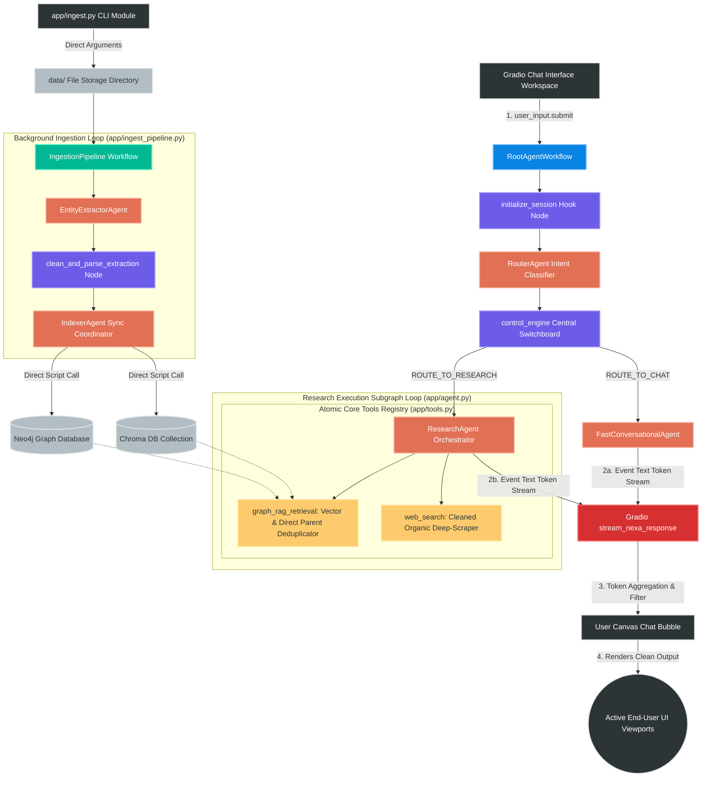
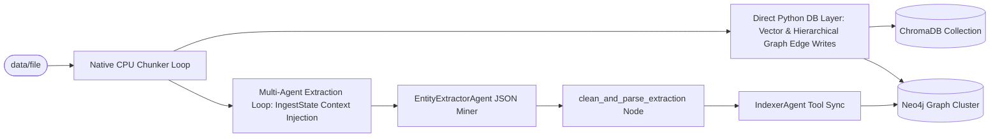

# 🧠 NexusMind Enterprise Architecture — Powered by Nexa

NexusMind is an enterprise-grade GraphRAG (Knowledge Graph + Vector Retrieval-Augmented Generation) platform engineered using the native **Google Agent Development Kit (ADK)** framework.

The platform implements a highly streamlined, low-latency execution layout by replacing multi-stage agentic middlemen with a high-performance **ResearchAgent** that handles tool execution, query alignment, and technical data synthesis directly.

---

## 🗺️ 1. Master System Architecture & Pipeline Diagrams

NexusMind separates its operational layers into a high-speed, programmatic **Asynchronous Batch Ingestion Pipeline** and an **Optimized, Deduplicated Multi-Database Research Loop**.

```text
                                [ PDF Document File Asset ]
                                             │
                                             ▼
                             [ Programmatic CPU Chunk Engine ]
                                (Instant Window Partitioning)
                                             │
                      ┌──────────────────────┴──────────────────────┐
                      ▼                                             ▼
       [ Child Sub-Chunk Arrays ]                      [ Parent Context Chunks ]
        (400 chars / 100 overlap)                          (2000 character blocks)
              │                                             │
              ▼                                             ▼
       ( Chroma Vector DB )                         ( Neo4j Knowledge Graph )
        └─ nomic-embed-text                           ├── Domain Knowledge Layer
                                                      ├── Semantic Claim Layer
                                                      └── Provenance Anchor Layer

```

### 1.1 Live Chat Interaction Turn & Execution Flow

Every user request is routed dynamically by a single programmatic central orchestration switchboard. The diagram below maps how a pristine query string navigates the gateway, splits conversational lines from complex research tasks, triggers direct parallel tools with parent context deduplication, and enforces zero-loss bulleted report compilation:



---

## 2. Minimalist Flat Project Layout

The repository utilizes an optimized, flat file topology structure designed to keep folder nesting levels to a minimum for transparent execution tracking on local MacBook workspaces:

```text
nexusmind-adk/                             # Root workspace repository
├── pyproject.toml                         # Project metadata and toolchain dependencies configurations
├── uv.lock                                # Fast internal locked dependency manifest
├── docker-compose.yaml                    # Local multi-container vector & graph database specs
├── gradio_app.py                          # Streamlined Client Interface Workspace Dashboard
├── architecture.md                        # Design blueprint details
├── PLANNING.md                            # Roadmap items and technical task notes
├── LICENSE                                # Repository permission rights
│
├── config/                                # System Settings Subsystem
│   ├── __init__.py                        # Config initiation block
│   └── settings.py                        # Pydantic Settings environment loader, dotenv bootstrap injector
│
├── data/                                  # Ingestion Landing Strip Directory (Isolated)
│   ├── ML_note.pdf                        # Target raw binary file copies prepared for parser pipelines
│   └── rag_book.pdf                       # Target domain knowledge asset
│
├── storage/                               # Local Mounted Persistent Clusters Volume Mapping
│   ├── chroma_data/                       # Chroma DB vector collection files
│   ├── neo4j_data/                        # Neo4j DBMS authorization and transaction databases
│   ├── pg_data/                           # Relational layer volume cache
│   └── redis_data/                        # Volatile task state cache arrays
├── scripts/  
|   └── ingest.py                          # Streamlined manual CLI entry point triggering parsing passes
│
└── app/                                   # Unified Core Backend Workspace Module
    ├── __init__.py                        # Package init exports
    ├── agent.py                           # Central Graph Topology, Control Switchboard, and Agent definitions
    ├── ingest_pipeline.py                 # Core background multi-block parsing ingestion pipeline loop
    ├── services.py                        # Programmatic database connectors & CPU-Bound parsing infrastructure
    └── tools.py                           # High-reliability Retrieval & Web Deep-Scraping Toolsets

```

---

## 3. Granular Pipeline Engineering Details

### 3.1 Central Routing & Direct Retrieval Loop (`app/agent.py`)

When an inquiry enters the runtime dashboard, it passes through an interleaved switchboard that guarantees zero context drift and completely isolates data references:

#### The Agent Chain:

1. **`initialize_session` [Hook Node]**: Coerces incoming raw data payloads safely into a clean string primitive, preventing nested token dictionary objects (`parts=[Part(...)]`) from bleeding down into agent parameter spaces, and caching the query in `ctx.state["user_query"]`.
2. **`RouterAgent`**: Performs a dynamic textual classification to verify intent, returning a single token string (`CHAT_PATH` or `RESEARCH_PATH`).
3. **`control_engine` [Central Orchestration Switch]**: Evaluates the routing classification string token. It intercepts the transfer loop, extracts the pristine user query string from the state cache, and issues a framework `Event` signal.
4. **`FastConversationalAgent`**: Catches simple greetings to generate fast, warm responses, completely bypassing database queries.
5. **`ResearchAgent`**: The primary analytical powerhouse. It executes the tools directly, ingests dense technical payloads concurrently, filters for semantic relevance against the target query, and generates a structured plain bulleted output.

```text
🔒 ResearchAgent Responding Laws:
- Output must use plain bullet points ONLY. No Markdown headers (# or ##), bold section dividers, or asterisks block layers.
- Inline body text must stay completely clean. It must not contain brackets, source tokens, or raw URLs.
- Citations, target Child/Parent hashes, and clean scraped website links are pushed to a dedicated references footer.

```

---

### 3.2 Background Hierarchical Ingestion Pipeline (`app/ingest_pipeline.py`)

To process large files efficiently without exhausting local memory limits, text formatting is managed programmatically on the CPU. The orchestrator invokes `pdf_processor.slice_hierarchical_chunks()` to construct parent segments (~2,000 characters) and child fragments (~400 characters, 100 overlap) in milliseconds.



#### Truncated JSON Fault Recovery

Because local models can experience mid-token text truncations, the `clean_and_parse_extraction` hook node runs an in-memory **Structural JSON Fault Recovery Layer** right before standard compilation.

It evaluates string balance, closes unclosed quotes, trims hanging key assignments (`"type": "Technolog`), and dynamically balances missing brackets (`}` or `]`). This prevents standard `json.loads()` parser exceptions from interrupting background ingestion flows.

---

## 🛠️ 4. Atomic Core Tools Subsystem (`app/tools.py`)

### 4.1 `graph_rag_retrieval(query)`

* **Vector Lookup:** Executes a spatial similarity proximity sweep against ChromaDB via `nomic-embed-text` to isolate top nearest-neighbor child chunk IDs.
* **Upward Target Graph Traversal:** Injects matching chunk IDs into an explicit single-direction upward Cypher query matching `-[:CHILD_OF]->`. This guarantees the engine only crawls upward to fetch the parent text block and blocks bi-directional sideways paths from pulling unrelated sibling fragments.
* **In-Memory Python Deduplication Layer:** Tracks parent document hashes inside an in-memory execution loop array (`seen_parent_ids`). If multiple child fragments point back to the same parent text block, the tool prints the 2,000-character context exactly once. Subsequent duplicates are automatically omitted (`[OMITTED DUP - SEE ABOVE FOR CONTEXT]`), saving thousands of context tokens.

### 4.2 `web_search(query)`

* **Organic Index Isolation:** Queries `html.duckduckgo.com` with clean search terms.
* **Dynamic Ad-Shield Domain Filters:** Parses every target landing link using Python's native `urlparse` module. It matches network locations (`netloc`) and paths (`path`) to drop advertisement tracker scripts (`/y.js`, `aclick`, `ad_domain`, `doubleclick`) instantly.
* **Parameter Scrubber:** Strips tracking variables (like `?utm_source=...` or `&click_metadata=...`) from organic target links using `urlunparse` to produce short, pristine citation URLs.
* **High-Density Scraper:** Feeds clean URLs to **`trafilatura.extract()`** first to strip away sidebars, headers, and footer noise. It features a custom BeautifulSoup tag-decomposer fallback (`"script"`, `"style"`, `"noscript"`, `"header"`, `"footer"`, `"svg"`) to handle protected domains cleanly.

---

## ⚡ 5. Installation, Production Launch & CLI Ingestion

### 1. Configure the Environment Specs

Ensure a `.env` file exists in your workspace directory containing these configuration settings:

```bash
EXECUTION_MODE="LOCAL"
LOCAL_LLM_URL="http://localhost:11434"

OLLAMA_MODEL="qwen2.5-coder:7b"
EMBEDDING_MODEL="nomic-embed-text"

CHROMA_HOST="localhost"
CHROMA_PORT=8000

NEO4J_URI="bolt://localhost:7687"
NEO4J_USER="neo4j"
NEO4J_PASSWORD="your_secure_neo4j_password"

```

### 2. Install Dependencies

Install the virtual environment package requirements:

```bash
uv add gradio httpx trafilatura beautifulsoup4 pydantic

```

### 3. Launch Storage Clusters

Launch your vector and graph database container instances via Docker in detached background mode:

```bash
docker compose up -d

```

### 4. Ingest PDF Documents via CLI

To split, map, extract, and index a local PDF asset file, run the manual command-line tool:

```bash
uv run -m scripts.ingest data/ML_note.pdf

```

### 5. Boot the Interactive Web Interface Dashboard

Launch the backend routing network and open the interactive client canvas:

```bash
uv run gradio_app.py

```

Once running, navigate to **`http://127.0.0.1:7860`** inside your browser window to test your unified, low-latency research engine.