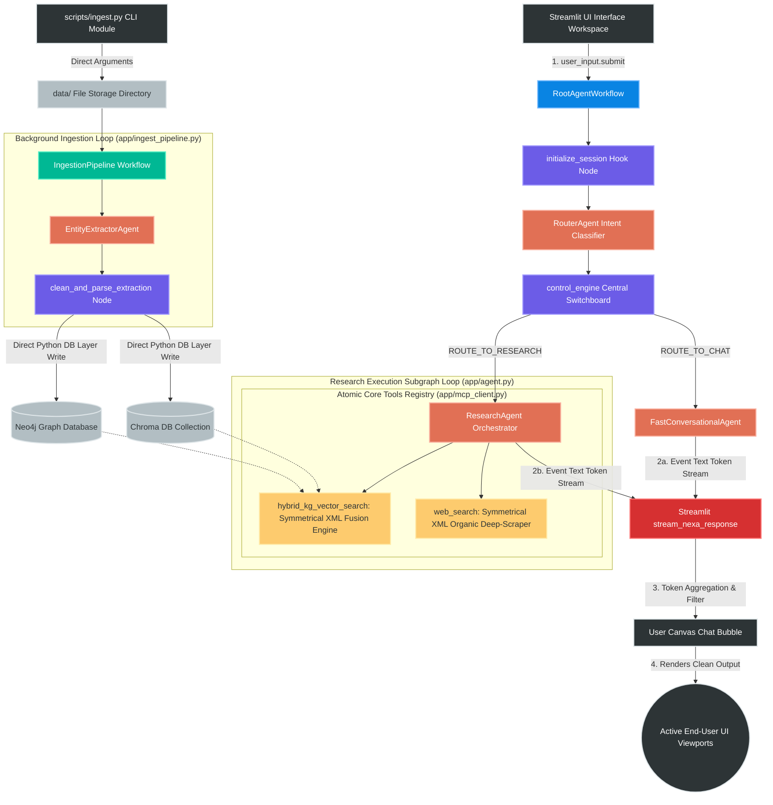

# 🧠 NexusMind Enterprise Architecture — Powered by Nexa

NexusMind is an enterprise-grade GraphRAG (Knowledge Graph + Vector Retrieval-Augmented Generation) platform engineered using the native **Google Agent Development Kit (ADK)** framework.

The platform implements a highly streamlined, low-latency execution layout by replacing multi-stage agentic middlemen with a high-performance **ResearchAgent** that handles tool execution, intent alignment, and high-density technical data synthesis directly via a unified, symmetrical XML payload protocol.

---

## 🏗️ 1. Core Architectural Strategy

Traditional Retrieval-Augmented Generation (RAG) suffers from **context fragmentation** (clipping crucial formulas or paragraphs during chunking) and **relationship blindness** (the inability to connect disparate chapters discussing the same core engineering principle).

NexusMind solves this by splitting storage responsibilities based on mathematical strengths:

| Storage Engine | Layer | Optimization Metric | Data Primitives |
| --- | --- | --- | --- |
| **ChromaDB** | Vector Space | Mathematical similarity math ($K$-Nearest Neighbors) via dense embeddings. | **Child Chunks**: Tiny text strings (~400 characters) built for fast semantic matching. |
| **Neo4j** | Knowledge Graph | Relational graph traversals, global context preservation, and semantic lineage tracking. | **Parent Chunks** (~2,000 characters) & **Explicit Entity Hubs** (`CONCEPT`, `TECHNOLOGY`, `SYSTEM`). |

The runtime layer collapses multi-agent overhead down to a single **ResearchAgent** running atomic, symmetrical Model Model Context Protocol (MCP) tools directly. This completely eliminates intermediate LLM latency steps, handles large documents cleanly, and filters out ad tracker URLs natively at the system boundary.

---

## 🗺️ 2. Master System Architecture & Pipeline Diagrams

NexusMind separates its operational layers into a high-speed, programmatic **Asynchronous Batch Ingestion Pipeline** and an **Optimized, Symmetrically XML-Structured Multi-Database Research Loop**.

```text
                                [ PDF Document File Asset ]
                                             │
                                             ▼
                             [ Programmatic CPU Chunk Engine ]
                                (Instant Window Partitioning)
                                             │
                      ┌──────────────────────┴──────────────────────┐
                      ▼                                             ▼
       [ Child Sub-Chunk Arrays ]                      [ Parent Context Chunks ]
        (400 chars / 100 overlap)                          (2000 character blocks)
              │                                             │
              ▼                                             ▼
       ( Chroma Vector DB )                         ( Neo4j Knowledge Graph )
        └─ nomic-embed-text                           ├── Domain Knowledge Layer
                                                      ├── Semantic Claim Layer
                                                      └── Provenance Anchor Layer

```

### 2.1 Live Chat Interaction Turn & Execution Flow

Every user request is routed dynamically by a single programmatic central orchestration switchboard. The diagram below maps how a query string navigates the gateway, splits conversational lines from complex research tasks, triggers direct parallel tools with symmetric XML formatting, and enforces deduplicated report compilation:



---

## 3. Minimalist Flat Project Layout

The repository utilizes an optimized, flat file topology structure designed to keep folder nesting levels to a minimum for transparent execution tracking on local MacBook workspaces:

```text
.
├── CYPHER_CHEATSEAT.md                    # Curated reference cheat sheet for custom graph mutations
├── LICENSE                                # Repository permission rights
├── README.md                              # Technical architecture blueprint and workspace guide
├── docker-compose.yaml                    # Multi-container local orchestration (Chroma, Neo4j, Redis, PG)
├── pyproject.toml                         # Project metadata, toolchain configs, and system dependencies
├── run.sh                                 # Global bootstrap script initiating runtime background nodes
├── streamlit_app.py                       # Streamlined production client canvas dashboard interface
├── architecture.md                        # Fine-grained design specs and algorithmic definitions
├── uv.lock                                # Fast internal locked deterministic dependency manifest
│
├── app/                                   # Unified Core Backend Application Module
│   ├── __init__.py                        # Package initialization engine hooks
│   ├── agent.py                           # Multi-agent switchboard topology, control engine, and agent specs
│   ├── ingest_pipeline.py                 # Core background multi-block parsing ingestion workflow layer
│   ├── mcp_client.py                      # Symmetrical XML Model Context Protocol retrieval tool registry
│   └── services.py                        # Programmatic database connectors & CPU-bound chunking layer
│
├── config/                                # System Settings Subsystem
│   ├── __init__.py                        # Configuration initiation bootstrap block
│   └── settings.py                        # Centralized property engine managing global workspace metrics
│
├── data/                                  # Ingestion Landing Strip Directory (Isolated PDF Drop)
│   ├── ML_note.pdf                        
│   └── rag_book.pdf                       
│
└── storage/                               # Local Mounted Persistent Clusters Volume Mapping
    ├── chroma_data/                       # Persistent vector database space
    ├── neo4j_data/                        # Neo4j Graph transaction logs, indices, and data storage files
    ├── pg_data/                           # Relational layer telemetry database volume mapping
    └── redis_data/                        # Volatile system cache files and append-only tracking dumps

```

---

## 📐 4. Phase 1: Knowledge Graph Construction (Ingestion Pipeline)

The preparation of the knowledge graph follows a rigorous pipeline that transitions from deterministic structural parsing to agentic semantic mining.

```text
[ Raw PDF Stream ]
       │
       ▼ (Step 4.1: Text Extraction)
[ Consolidated Raw Text String ]
       │
       ▼ (Step 4.2: Hierarchical Chunking)
 ├── Parent Block (2000 chars) ──► Saved to Neo4j (`ParentChunk`)
 │       │
 │       └───► Child Fragment 1 (400 chars) ──► Saved to Neo4j (`ChildChunk`)
 │       └───► Child Fragment 2 (400 chars) ──► Saved to Neo4j (`ChildChunk`)
 │
 ├── (Step 4.3: Deterministic Database Writes)
 │       ├───► ChromaDB: Generate vector embeddings ➔ Insert child record
 │       └───► Neo4j: Write structural hierarchy line: `(Child)-[:CHILD_OF]->(parent)`
 │
 └── (Step 4.4: Agentic Entity Extraction & Decision Matrix)
         └───► EntityExtractorAgent (Local 7B LLM Processing Input Window)
                 └───► Parsing Node (JSON Sanitation & Parameter Reconstruction)
                         └───► Neo4j: Connect Semantic Anchor: `(Entity)-[:MENTIONED_IN]->(Child)`

```

### 🔹 Step 4.1: Binary Layout Extraction

The system loads unformatted asset files (e.g., `ML_note.pdf`) through `pypdf`. The engine iterates across page loops, strips trailing garbage text, normalizes text encodings, and concatenates the output into a single continuous Python string block.

### 🔹 Step 4.2: Deterministic Hierarchical Chunking

Instead of slicing text blindly, the system creates an explicit **Parent-Child Parentage Mesh** using sliding string boundaries on the CPU:

1. **Parent Chunks:** The engine extracts structural text blocks with a maximum window size of 2,000 characters to preserve complete logical modules (chapters, long architectural proofs).
2. **Child Chunks:** Inside each Parent window, the system creates smaller sub-slice text fragments of 400 characters, applying a 100-character overlap safety barrier.
3. **Standardized ID Generation:** Persistent key strings are deterministically minted using the uppercase source asset prefix:
* Parent ID: `[FILENAME]-PARENT-[INDEX]` (e.g., `ML_NOTE-PARENT-001`)
* Child ID: `[FILENAME]-CHUNK-[INDEX]` (e.g., `ML_NOTE-CHUNK-001`)


### 🔹 Step 4.3: Layer 1 Deterministic Database Storage

Before running any AI models, raw text fragments are saved using direct Python infrastructure tools to guarantee 100% structural baseline integrity:

* **ChromaDB Commit:** The child fragment's text is converted into a vector embedding array by querying the local Ollama embedding API (`/api/embeddings`) using `nomic-embed-text`. The record is committed along with its text body and a `parent_id` metadata tag.
* **Neo4j Structural Commit:** A Cypher transaction writes the core layout nodes, merging the child and parent nodes while mapping a permanent structural hierarchy:
```cypher
(ChildChunk:DocumentNode)-[:CHILD_OF]->(ParentChunk:DocumentNode)

```


### 🔹 Step 4.4: Layer 2 Agentic Semantic Extraction

Once the skeleton is secured, the multi-agent orchestration layer builds the **Semantic Index**.

* **The Entity Decision Matrix (LLM Logic):** The `EntityExtractorAgent` runs against a local 7B model. It receives a packaged text payload and evaluates abstractions against strict taxonomic criteria (`TECHNOLOGY`, `SYSTEM`, `CONCEPT`). Common conversational phrases are discarded.
* **The Secure Token Integration Bridge:** To prevent smaller models from losing track of variables, the workflow uses a **Token-Enclosed Session Tracking** pattern. The engine embeds the destination chunk ID into an isolated session identifier tag (`session--[CHUNK_ID]--[UUID]`). The `clean_and_parse_extraction` transformation node safely extracts the target chunk ID from this session token string using direct Python code, matches it with the validated entity JSON payload, and writes an incoming `[:MENTIONED_IN]` relationship line.
* **Truncated JSON Fault Recovery:** Because local models can experience mid-token text truncations during heavy extraction loops, the `clean_and_parse_extraction` hook node runs an in-memory **Structural JSON Fault Recovery Layer** right before compilation. It evaluates string balance, closes unclosed quotes, trims hanging key assignments (`"type": "Technolog`), and dynamically balances missing brackets (`}` or `]`). This prevents standard parser exceptions from interrupting background ingestion streams.

---

## 🔍 5. Phase 2: The High-Speed Hybrid Search Engine

When a user submits a question to the system, query resolution transitions from geometric vector routing to multi-hop graph reasoning and organic live web scraping. All tool results are unified under matching, symmetrical XML string payloads to avoid attention bias.

```text
[ User Prompt Input ] ➔ "Explain Deep Learning Feature Extraction"
       │
       ▼ (Step 5.1: Session Initialization & Routing)
[ Input Sanitization Hook ] ➔ Coerces raw matrix objects into clean string primitives
       │
       ▼
[ RouterAgent Switchboard ] ➔ Classifies intent (CHAT_PATH vs. RESEARCH_PATH)
       │
       ▼ (ROUTE_TO_RESEARCH)
[ ResearchAgent Orchestrator ] ➔ Launches parallel Python tool execution
       ├───► hybrid_kg_vector_search(query)
       │         ├── ChromaDB vector similarity lookup (Top K 768-dimension embeddings)
       │         └── Neo4j pure adaptive map query: Introspects property shapes dynamically
       │         └── Python In-Memory Deduplication: Suppresses duplicate parent context text loops
       │
       └───► web_search(query)
                 ├── Scrapes html.duckduckgo.com landing index directories
                 ├── urlparse ad-shield domain filter: Drops tracking links (/y.js, aclick)
                 └── urlunparse query parameter scrubber + trafilatura symmetrical XML wrapper
       │
       ▼ (Step 5.2: Context Synthesis & Generation Turn)
[ Flat Plain Bullet Summary ] ➔ Symmetrical XML components blended into unified technical narrative
[ References Footer Block ]  ➔ Isolated listing of all parent chunk IDs and absolute URLs at the hard bottom

```

### 🔹 Step 5.1: Session Initialization & Input Sanitization

To prevent nested JSON dictionary tokens (`parts=[Part(...)]`) from bleeding into the agent parameters, the execution turn targets a dedicated initialization node:

* **The Hook Node (`initialize_session`)**: Captures the raw runtime payload, evaluates it for text properties, extracts a clean string primitive, and commits it securely to `ctx.state["user_query"]`.
* **The Orchestration Switch (`control_engine`)**: Pulls the clean string primitive from the state cache, bypasses multi-stage agentic middlemen, and routes execution directly to the tool-equipped `ResearchAgent`.
* **The Intent Registry Routing Switch:** The `RouterAgent` splits the paths cleanly. Casual conversational queries bypass heavy data hits entirely and land on the `FastConversationalAgent`, while technical prompts activate the primary dual-engine processing lane.

### 🔹 Step 5.2: Execution of Atomic Clean Tools (Symmetrical XML Format)

To eliminate the **Context Structure Clash** where the LLM's attention mechanism favors one tool type over another, both tools return data encapsulated in identical, uniform XML schemas (`<knowledge_source>` $\rightarrow$ `<record>`).

#### 🚀 1. GraphRAG Traversal with Python In-Memory Deduplication

The tool targets the isolated string query, generates a dense mathematical vector, and pulls the nearest child nodes from ChromaDB matching its 768-dimension shape definition. It passes these IDs to Neo4j using a pure, valid Cypher list comprehension block to fetch parent context dynamically without causing schema notification warnings:

```cypher
MATCH (c:DocumentNode) WHERE c.id IN $chunk_ids
OPTIONAL MATCH (c)-[:CHILD_OF]->(p:DocumentNode)
OPTIONAL MATCH (entity)-[:MENTIONED_IN]->(c)

WITH c, p, entity, properties(p) AS raw_props
WITH c, p, entity, raw_props,
     [k IN keys(raw_props) WHERE NOT k IN ['id', 'type', 'created_at'] | raw_props[k]] AS dynamic_values

RETURN c.id AS chunk_id, 
       p.id AS parent_id, 
       coalesce(raw_props.text, raw_props.content, raw_props.body, dynamic_values[0], '') AS parent_text, 
       collect(DISTINCT coalesce(entity.id, '')) AS concepts

```

* **The Python Deduplication Guard:** To prevent identical 2,000-character parent paragraphs from hitting the local context window multiple times, an in-memory loop tracking set (`seen_parent_ids`) is introduced. If a parent block has already been read during the execution cycle, its body text is suppressed (`[OMITTED_DUPLICATE_REFERENCE]`), while compiling any newly uncovered technical metadata tags.
* **Terminal Flood Control Logging:** Upstream framework loggers are overridden to `WARNING` at runtime. The file outputs exactly **one clean status tracker line** using `logger.info()` per prompt request to keep your shell display completely clean.

#### 🌐 2. Web Search with Ad-Shield Domain Filters

The scraper queries `html.duckduckgo.com` and filters raw results through a dual validation engine:

* **The Ad Shield Tracker:** Parses incoming candidate links using `urllib.parse.urlparse`. It intercepts network locations (`netloc`) and path strings (`path`) to drop advertisement redirect blocks (`/y.js`, `aclick`, `ad_domain`, `doubleclick`) instantly.
* **The Parameter Scrubber:** Organic targets are reconstructed using `urlunparse` to drop messy query strings (`?utm_source=...`), protecting context length.
* **The Main-Text Extractor:** Cleaned URLs are processed by `trafilatura.extract()` to isolate technical paragraph contents while completely discarding sidebars, headers, or layout wrappers.
* **Symmetrical XML Mapping:** Outputs data mirroring the vector data schema exactly using `<specific_fact>`, `<parent_lineage>`, and `<semantic_entities>` XML wrappers.

### 🔹 Step 5.3: Context Synthesis & Response Generation Turn

The `ResearchAgent` receives these dense, cleaned, symmetrical XML strings. It maps them against its target goal instructions using strict styling laws designed for local models (`qwen2.5-coder:7b`):

1. **Fact Isolation:** Inline bullet points summarize technical findings comprehensively, fully stripped of brackets, citation tags, or raw URLs.
2. **Anonymous Harmonization:** The text must present data as a single technical reality without referencing the infrastructure layer explicitly (no "the database shows" or "according to the web scrape").
3. **References Consolidation:** All source details, chunk hashes, and domain locations are pushed cleanly to the bottom of the response under an isolated references footer separated by a literal horizontal rule (`---`).

---

## ⚡ 6. Installation, Production Launch & CLI Ingestion

### 1. Configure Workspace Settings

Create a `.env` file in the root workspace directory matching your project configurations:

```bash
# Core Parameters
ENVIRONMENT="dev"
OMEGA_NETWORK_TIMEOUT="15.0"
OMEGA_SEARCH_MAX_RESULTS="3"

# Database Server Pointers
LOCAL_LLM_URL="http://localhost:11434"
OLLAMA_MODEL="qwen2.5-coder:7b"
EMBEDDING_MODEL="nomic-embed-text"

CHROMA_HOST="localhost"
CHROMA_PORT=8000
CHROMA_COLLECTION="nexus_knowledge_pool"

NEO4J_URI="bolt://localhost:7687"
NEO4J_USER="neo4j"
NEO4J_PASSWORD="your_secure_password"

```

### 2. Launch Local Storage Containers via Docker

Spin up your background network server database instances in detached mode:

```bash
docker compose up -d

```

### 3. Initialize the Neo4j Lucene Fulltext Index

Log into your local Neo4j Browser Console panel at `http://localhost:7474` and execute this schema indexing statement **once** to enable text searches:

```cypher
CREATE FULLTEXT INDEX document_keyword_index IF NOT EXISTS
FOR (n:DocumentNode)
ON EACH [n.text]

```

### 4. Ingest Local PDF Files via CLI

To parse, map, fragment, and index a targeted document asset inside your active multi-database network, execute the script block manager:

```bash
uv run scripts/ingest.py

```

### 5. Launch the Interactive Interface Canvas Workspace

Boot your backend routing workflow pipeline and map the production frontend canvas to your local browser window:

```bash
uv run streamlit_app.py

```

Once initialized, navigate your active browser viewport to **`http://localhost:8501`** to test your unified, high-performance GraphRAG research application layout!

---

## 📊 7. Dedicated Cypher Query Administration Sheet

Execute these validation and maintenance queries inside your Neo4j Browser dashboard (`http://localhost:7474`) to monitor index profiles, debug schemas, or clear system parameters.

### 🔹 7.1 Database Index Verification

Verify that your schema index limits and constraints are compiled and actively operational.

```cypher
SHOW INDEXES;

```

### 🔹 7.2 Total Document Node Count Matrix

Run this to see a quick summary breakdown of every structural node label committed to your instance.

```cypher
MATCH (n)
RETURN labels(n) AS Node_Label, count(n) AS Total_Nodes
ORDER BY Total_Nodes DESC;

```

### 🔹 7.3 Ingestion Integrity Check: Unlinked Child Chunks

Every `ChildChunk` must have an outgoing edge to a parent text block. This query isolates any broken orphan nodes that failed step 4.3 of your pipeline.

```cypher
MATCH (c:DocumentNode)
WHERE NOT (c)-[:CHILD_OF]->(:DocumentNode)
RETURN c.id AS Orphan_Chunk_ID, coalesce(c.text, c.content)[:100] AS Snippet;

```

### 🔹 7.4 Inspect Parent-to-Child Cluster Hierarchy

Tracks a specific document asset to ensure your sliding string boundaries mapped parentage correctly.

```cypher
MATCH (p:DocumentNode) WHERE p.id CONTAINS 'ML_NOTE' AND p.id CONTAINS 'PARENT'
MATCH (c:DocumentNode)-[:CHILD_OF]->(p)
RETURN p.id AS Parent_ID, count(c) AS Attached_Child_Chunks, collect(c.id) AS Child_IDs
ORDER BY Parent_ID ASC;

```

### 🔹 7.5 Inspect Semantic Knowledge Connections

Audits your `EntityExtractorAgent` performance by counting how many conceptual nodes are successfully linked to child data pointers.

```cypher
MATCH (e)-[r:MENTIONED_IN]->(c:DocumentNode)
RETURN labels(e)[0] AS Entity_Type, count(r) AS Total_Semantic_Links
ORDER BY Total_Semantic_Links DESC;

```

### 🔹 7.6 Simulate Phase 2 Multi-Hop Search Traversal

Simulates what your `ResearchAgent` encounters inside the horizontal and vertical graph hops during an active retrieval execution turn.

```cypher
MATCH (c:DocumentNode {id: "ML_NOTE-CHUNK-001"})
MATCH (c)-[r1:CHILD_OF]->(p:DocumentNode)
OPTIONAL MATCH (entity)-[r2:MENTIONED_IN]->(c)
RETURN c, r1, p, entity, r2;

```

### 🔹 7.7 Isolate High-Density Semantic Concept Hubs

Finds the top 10 concepts that are mentioned most frequently across your documents to locate major subject-matter focus points.

```cypher
MATCH (e)-[:MENTIONED_IN]->(c:DocumentNode)
RETURN e.id AS Core_Concept, count(c) AS Mention_Count
ORDER BY Mention_Count DESC
LIMIT 10;

```

### 🔹 7.8 Wipe and Clear Active Ingested Graph Records

Wipes active structural and semantic indexes to run a clean ingestion cycle over your data folder without breaking system database configurations or clearing user accounts:

```cypher
MATCH (n:DocumentNode)
DETACH DELETE n;

MATCH (c:CONCEPT) DETACH DELETE c;
MATCH (t:TECHNOLOGY) DETACH DELETE t;
MATCH (s:SYSTEM) DETACH DELETE s;

```
