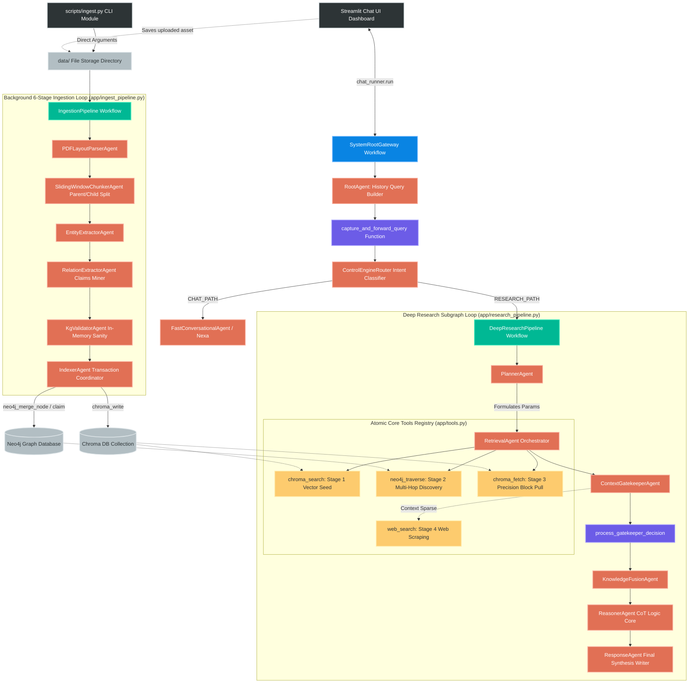
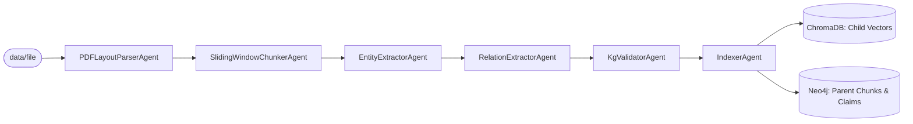

# 🧠 NexusMind Enterprise Architecture — Powered by Nexa

NexusMind is an enterprise-grade GraphRAG (Knowledge Graph + Vector Retrieval-Augmented Generation) platform engineered using the native **Google Agent Development Kit (ADK)** framework. 

The architecture completely decouples background knowledge graph synthesis from real-time user query traversal threads. It introduces an advanced **Hierarchical Parent-Child Splitting** model to handle large-scale PDFs and structures a dynamic **Context Gatekeeper Agent** to eliminate data invisibility by selectively managing live internet fallback logic.

---

## 🗺️ 1. Master System Architecture & Pipeline Diagrams

NexusMind completely replaces monolithic database lookups with a highly fine-grained, modular ecosystem. The system separates the operational layers into an **Asynchronous Batch Ingestion Pipeline** and an **Interleaved Multi-Stage Research Loop**.

```text
                                [ PDF Document File Asset ]
                                             │
                                             ▼
                             [ Enriched Hierarchical Splitting ]
                                             │
                      ┌──────────────────────┴──────────────────────┐
                      ▼                                             ▼
       [ Child Sub-Chunk Arrays ]                      [ Parent Header Chunks ]
              │                                             │
              ▼                                             ▼
       ( Chroma Vector DB )                         ( Neo4j Knowledge Graph )
                                                      ├── Domain Knowledge Layer
                                                      ├── Semantic Claim Layer
                                                      └── Provenance Anchor Layer

```

### 1.1 Live Chat Interaction Turn & Execution Flow

Every frontend conversational request follows a strict supervisor-routing loop. The diagram below maps how an query navigates through the gateway, evaluates intent, traverses database maps, and handles live external fail-safes:



---

## 2. Minimalist Flat Project Layout

The repository utilizes an optimized, flat file topology structure designed to keep folder levels at a minimum for simple execution overhead tracking:

```text
nexusmind-adk/                             # Root workspace repository
├── pyproject.toml                         # Project metadata and toolchain dependencies configurations
├── uv.lock                                # Fast internal locked dependency manifest
├── docker-compose.yaml                    # Local multi-container vector & graph database specs
├── main.py                                # Pre-flight hardware connectivity verification & diagnostics
├── run.sh                                 # Global environment check & runtime service execution gateway
├── streamlit_app.py                       # Client interface dashboard (Direct runner connection, no engine middleman)
├── PLANNING.md                            # Blueprint, task items, and technical notes
├── LICENSE                                # Repository permission rights
├── nexusmind_runtime.log                  # Rolling backend operational tracking output trace
│
├── config/                                # System Settings Subsystem
│   ├── __init__.py                        # Config initiation block
│   └── settings.py                        # Pydantic Settings environment loader, dotenv bootstrap injector
│
├── data/                                  # Ingestion Landing Strip Directory (Isolated)
│   └── rag_details.pdf                    # Target raw binary file copies prepared for parser pipelines
│
├── scripts/                               # Production Operational Shell Wrappers
│   ├── __init__.py                        # Script pack exports
│   └── ingest.py                          # Streamlined CLI module triggering file-driven ingest workers
│
└── app/                                   # Unified Core Backend Workspace Module
    ├── __init__.py                        # Package init exports
    ├── agent.py                           # Framework bridge file re-exporting root_agent for adk web UI
    ├── root_gateway.py                    # Gateway orchestrator (Supervisor Agent, Router Graph, and Paths)
    ├── research_pipeline.py               # 5-stage deep analytical reasoning workflow layout
    ├── ingest_pipeline.py                 # 6-stage background processing utilizing ParallelAgent forks
    ├── infrastructure.py                  # PyPDF extractors, Chroma HTTP clients, and Neo4j connection poolers
    ├── tools.py                           # Functional read/write database tool sets bridged to ADK wrappers
    └── states.py                          # Unified prompt instruction vault and structured Pydantic schemas

```

---

## 3. Granular Pipeline Engineering Details

### 3.1 Background Hierarchical Ingestion Pipeline (`app/ingest_pipeline.py`)

To prevent large manuals from breaking local context boundaries, this pipeline implements **Hierarchical Parent-Child Splitting** across 6 sequential agents. It flattens the file text content, partitions it into structural parent blocks (e.g., 2000 characters) based on headers, splits those into dense, overlapping child sub-chunks (e.g., 400 characters), and indexes them cross-retained.



#### The Agent Chain:

1. **`PDFLayoutParserAgent`**: Unpacks layout binary byte streams, stripping out footers, headers, and structural formatting noise to pass clean text down.
2. **`SlidingWindowChunkerAgent`**: Slices raw text streams hierarchically. It isolates large semantic **Parent chunks** along section markers while mapping smaller overlapping **Child fragments** underneath them.
3. **`EntityExtractorAgent`**: Mines technical domain nodes (`Component`, `Architecture`, `Constraint`, `Metric`) from each chunk text, formatting an encyclopedic JSON map including short failure mode properties.
4. **`RelationExtractorAgent`**: Identifies operational system interactions (`DEPENDS_ON`, `FEEDS_DATA_TO`, `HAS_CONSTRAINT`, `MITIGATES`) and isolates them into structured intermediate **Interaction Claim** JSON models.
5. **`KgValidatorAgent`**: Operates entirely within runtime memory cache to check structural referential integrity. It cleans dangling node metrics and purges orphaned edge references before transaction execution.
6. **`IndexerAgent`**: The database commit orchestrator. It calls the active tools concurrently, saving child text strings into **Chroma**, loading the Parent blocks into **Neo4j**, and stitching them together via explicit provenance edges (`[:MENTIONED_IN] -> (:ChildChunk)`).

---

### 3.2 Dynamic Multi-Stage Research Loop (`app/research_pipeline.py`)

When a query enters the research workflow, the agents do not perform standalone vector searches. Instead, they run an interleaved retrieval funnel to explore multi-hop factual chains and verify visibility.

#### The Agent Chain:

1. **`PlannerAgent`**: Deconstructs the initial text inquiry, outputting a precise JSON parameter map containing optimized search keys.
2. **`RetrievalAgent`**: The pipeline gatherer. It executes an interleaved multi-database loop using python tools:
* **Stage 1 (`chroma_search`):** Scans Chroma to retrieve the top nearest-neighbor child sub-chunks.
* **Stage 2 (`neo4j_traverse`):** Reads the retrieved chunk IDs, enters Neo4j, climbs up to the structural Parent node, and traverses 1–2 hops out to discover connected components and hidden structural **Claims**.
* **Stage 3 (`chroma_fetch`):** Precision-extracts missing neighboring text segments using the target IDs returned during the graph traversal.


3. **`ContextGatekeeperAgent`**: **The system evaluator core.** It evaluates the combined text payload against the user's initial question to verify completeness.
* *Verdict -> Sufficient:* Forwards data down to the fusion block.
* *Verdict -> Sparse Context:* Automatically executes **Stage 4 (`web_search`)** to scrape missing real-time duckduckgo context, merges it with the database content records, and forwards the package.


4. **`KnowledgeFusionAgent`**: Formats the combined data streams, grouping overlapping semantic points into a clean, high-density layout.
5. **`ReasonerAgent`**: Runs a multi-turn Chain-of-Thought (CoT) deduction process over the data block, tracing how the graph layout matches the vector facts.
6. **`ResponseAgent`**: Compiles the final answer in publication-grade markdown with strict, inline bracketed source citations pointing directly back to document chunks.

---

### 3.3 System Root Supervisor Gateway (`app/root_gateway.py`)

This pipeline serves as the primary system entrypoint, managing conversational turns, keeping state parameters persistent, and shielding local LLMs from context drift or hallucinated completions.

1. **`RootAgent`**: Acts as a standalone query rewriter. It parses conversation histories to distill multi-turn context into a standalone inquiry.
2. **`capture_and_forward_query`**: A Python interceptor function that saves the rewritten standalone query string inside the workflow context state instance (`resolved_query`) before routing.
3. **`ControlEngineRouter`**: An intent classifier agent that reads the clean string and outputs a single uppercase token token (`RESEARCH` or `CASUAL_CHAT`).
4. **`determine_workflow_path`**: Evaluates the keyword token. If `RESEARCH` is matched, it fetches the pristine `resolved_query` back out from memory context state and forwards it down into the `deep_research_subgraph`. If `CASUAL_CHAT` is matched, it routes to `FastConversationalAgent`.

---

## 🛠️ 4. Atomic Core Tools Subsystem (`app/tools.py`)

To allow the ADK framework to run tasks concurrently or map dependencies sequentially, operations are decoupled into atomic python modules:

### Ingestion Tool Registry

* **`chroma_write`**: Vectorizes and indexes a single child text chunk into Chroma, returning the unique identity string token format `{document_name}_chunk_{index}`.
* **`neo4j_merge_node`**: Creates or updates a domain concept classification node, applying deep properties and anchoring its reference to the vector chunk token.
* **`neo4j_merge_claim`**: Implements relationship reification. It creates an independent `(:Interaction)` node with condition properties, binds it between subject/object entities, and hooks its provenance path directly to the chunk ID.

### Retrieval Tool Registry

* **`chroma_search`**: Runs an active vector similarity scan against Chroma to grab top child sub-chunks matching the query.
* **`neo4j_traverse`**: Runs an advanced Cypher lookup extending outward from a chunk token to return multi-hop element graphs and structural interaction rules.
* **`chroma_fetch`**: Fetches the raw text content of any target chunk ID found via the graph.
* **`web_search`**: Scrapes external network channels as an emergency fallback if the local knowledge pool is sparse.

---

## ⚡ 5. Installation, Production Launch & CLI Ingestion

### 1. Configure the Environment Specs

Ensure a `.env` file exists in your project's root workspace directory containing these topology configurations:

```bash
# Options: LOCAL (Ollama Local Topology) or CLOUD (Gemini Cloud)
EXECUTION_MODE="LOCAL"

GEMINI_API_KEY="your_google_ai_studio_api_key"
LOCAL_LLM_URL="http://localhost:11434"

OLLAMA_MODEL="qwen2.5-coder:7b"
GEMINI_MODEL="gemini/gemini-2.5-flash"

CHROMA_HOST="localhost"
CHROMA_PORT=8000

NEO4J_URI="bolt://localhost:7687"
NEO4J_USER="neo4j"
NEO4J_PASSWORD="your_neo4j_password"

```

### 2. Launch Storage Clusters

Launch your vector and graph database container instances in detached background mode:

```bash
docker compose up -d

```

### 3. Ingest PDF Documents via CLI

To ingest documents directly via the terminal workspace, execute the standalone ingestion module with the source file location path:

```bash
python -m scripts.ingest data/rag_details.pdf

```

### 4. Boot the Interactive Web Interface Dashboard

Launch the unified client dashboard UI to chat with **Nexa** and monitor cognitive retrieval paths:

```bash
streamlit run streamlit_app.py

```

```
---
