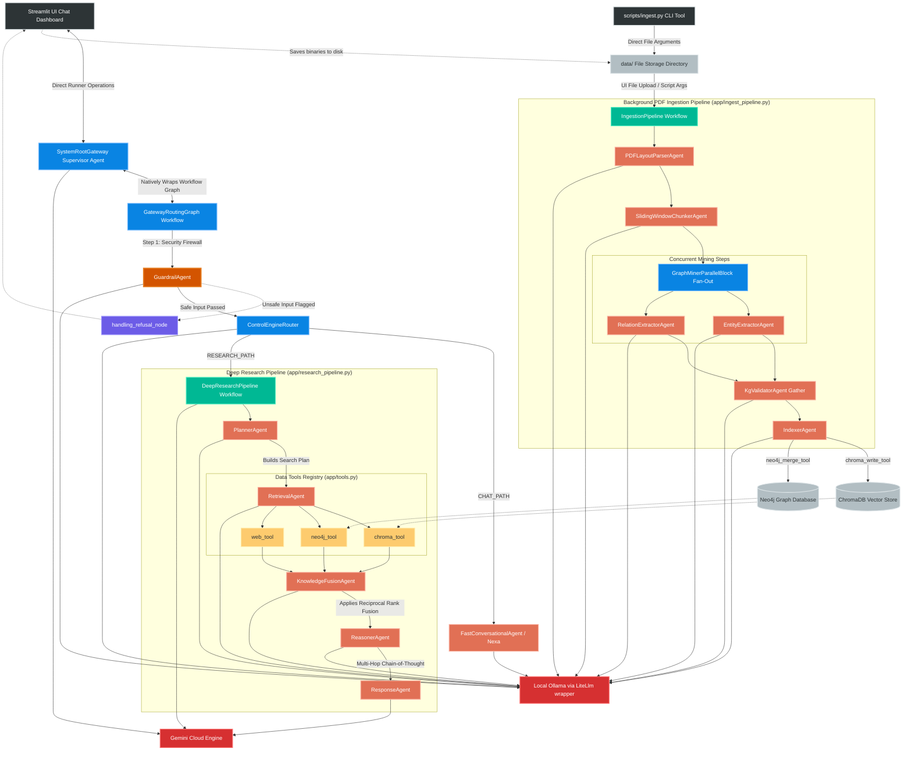
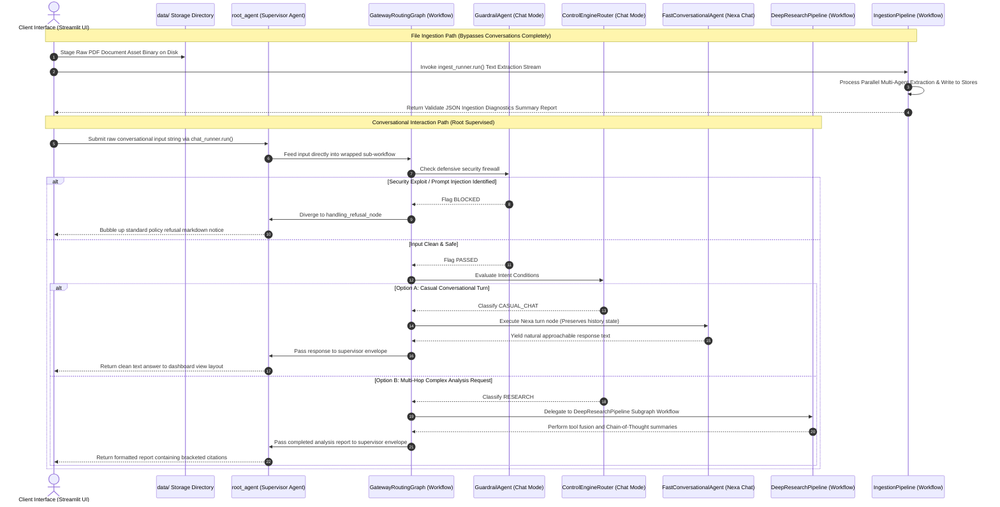
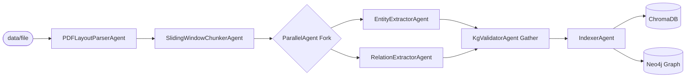

# 🧠 NexusMind Enterprise Architecture — Powered by Nexa

NexusMind is an enterprise-grade GraphRAG (Knowledge Graph + Vector Retrieval-Augmented Generation) platform engineered using the native **Google Agent Development Kit (ADK)** framework. The architecture completely decouples background knowledge graph synthesis from real-time user query traversal threads.

By unifying local inference engines (**Ollama: `qwen2.5-coder:7b**` via the canonical **`google.adk.models.lite_llm.LiteLlm`** abstraction for privacy, local embedding workflows, and edge-speed calculations) with high-context cloud endpoints (**Gemini Cloud: `gemini/gemini-2.5-flash**` for deep analytical orchestration and dynamic tool-routing), NexusMind provides a stateful, interactive experience. The system's central concierge, **Nexa**, supports multi-hop reasoning, unified document indexing, and user-driven exploratory follow-ups.

---

## 1. System Topology & Architectural Flows

### 1.1 Macro-System Communication Subsystems

The diagram below details the simplified transaction paths: an isolated, file-driven pipeline for background batch ingestion, and a unified, supervisor-driven execution loop mapping safely to final response targets.



### 1.2 System Runtime Interaction Loop

The sequence diagram below displays the updated step-by-step transaction lifecycle showing how every frontend query routes completely through the root Supervisor Agent:



---

## 2. Minimalist Flat Project Layout

The repository utilizes an optimized, flat file topology structure designed to keep folder levels at a minimum for simple execution overhead tracking:

```text
nexusmind-adk/                             # Root workspace repository
├── pyproject.toml                         # Project metadata and toolchain dependencies configurations
├── uv.lock                                # Fast internal locked dependency manifest
├── docker-compose.yaml                    # Local multi-container vector & graph database specs
├── main.py                                # Pre-flight hardware connectivity verification & diagnostics
├── run.sh                                 # Global environment check & runtime service execution gateway
├── streamlit_app.py                       # Client interface dashboard (Direct runner connection, no engine middleman)
├── PLANNING.md                            # Blueprint, task items, and technical notes
├── LICENSE                                # Repository permission rights
├── nexusmind_runtime.log                  # Rolling backend operational tracking output trace
│
├── config/                                # System Settings Subsystem
│   ├── __init__.py                        # Config initiation block
│   └── settings.py                        # Pydantic Settings environment loader, dotenv bootstrap injector
│
├── data/                                  # Ingestion Landing Strip Directory (Isolated)
│   └── rag_book.pdf                       # Target raw binary file copies prepared for parser pipelines
│
├── scripts/                               # Production Operational Shell Wrappers
│   ├── __init__.py                        # Script pack exports
│   ├── ingest.py                          # Streamlined CLI module triggering file-driven ingest workers
│   └── test_connection.py                 # Network link sanity verification scripts
│
└── app/                                   # Unified Core Backend Workspace Module
    ├── __init__.py                        # Package init exports
    ├── agent.py                           # Framework bridge file re-exporting root_agent for adk web UI
    ├── root_gateway.py                    # Gateway orchestrator (Supervisor Agent, Router Graph, and Paths)
    ├── research_pipeline.py               # 5-stage deep analytical reasoning workflow layout
    ├── ingest_pipeline.py                 # 6-stage background processing utilizing ParallelAgent forks
    ├── infrastructure.py                  # PyPDF extractors, Chroma HTTP clients, and Neo4j connection poolers
    ├── tools.py                           # Functional read/write database tool sets bridged to ADK wrappers
    └── states.py                          # Unified prompt instruction vault and structured Pydantic schemas

```

---

## 3. Granular Agent & Pipeline Engineering Details

### 3.1 Parallel Async Background Ingestion Pipeline

Processes incoming files into high-fidelity context spaces across both storage engines simultaneously through structural steps, utilizing native ADK `ParallelAgent` async blocks:



#### Detailed Ingestion Chain:

1. **`PDFLayoutParserAgent`**: Unpacks layout byte streams from the `data/` folder copy and extracts clear, structured raw text.
2. **`SlidingWindowChunkerAgent`**: Partitions raw text into 500-character windows with a continuous 100-character overlapping tail to preserve context.
3. **`EntityExtractorAgent`**: Parses isolated text fragments to extract structural categories (`SYSTEM`, `TECHNOLOGY`, `PERSON`).
4. **`RelationExtractorAgent`**: Explores intersections between items to formulate connection predicates (`SCREAMING_SNAKE_CASE`).
5. **`KgValidatorAgent`**: Sanitizes the graph matrix entirely inline within its context memory to eliminate hallucinated function calls (such as calling imaginary `validate_graph` tool nodes), purging broken links or dangling connection lineages.
6. **`IndexerAgent`**: Database commit broker deploying text fragments to Chroma via `chroma_write_tool` and graph nodes/edges to Neo4j via `neo4j_merge_tool`.

### 3.2 Dynamic Retrieval & Multi-Hop Reasoning Pipeline

Processes deep exploratory queries by evaluating context indices through consecutive multi-agent tasks:

* **`PlannerAgent`**: Breaks compound query instructions into targeted search strategies.
* **`RetrievalAgent`**: Executes contextual tools (`chroma_tool`, `neo4j_tool`, `web_tool`) concurrently.
* **`KnowledgeFusionAgent`**: Deduplicates and cross-references multi-source outputs using **Reciprocal Rank Fusion (RRF)**:

$$RRF\_Score(d \in D) = \sum_{m \in M} \frac{1}{60 + r_m(d)}$$

* **`ReasonerAgent`**: Performs a multi-hop Chain-of-Thought (CoT) sequence over the fused context to resolve hidden linkages.
* **`ResponseAgent`**: Builds the final response layout in markdown with bracketed source tracking and yields 3 interactive follow-up suggestion pills.

---

## 4. Installation & Production Launch Commands

### 1. Initialize Virtual Environment and Workspace Dependencies

Ensure you have `uv` installed. Run these commands from your root terminal:

```bash
# Create local virtual python environment sandbox
uv venv

# Activate local environment
source .venv/bin/activate  # Windows command: .venv\Scripts\activate

# Install dependencies and map the local project workspace
uv sync

```

### 2. Configure Environment Secrets

Ensure a `.env` file exists in your project's root directory containing these configurations. The `EXECUTION_MODE` parameter acts as a global switch enabling instant swapping between hardware targets:

```bash
# --- Orchestration Controller Switch ---
# Options: LOCAL (Ollama Local Graph) or CLOUD (Gemini Cloud Studio Graph)
EXECUTION_MODE="LOCAL"

# --- Model Provider Endpoints ---
GEMINI_API_KEY="your_google_ai_studio_api_key"
LOCAL_LLM_URL="http://localhost:11434"

# --- Model Specific Assignments ---
OLLAMA_MODEL="qwen2.5-coder:7b"
GEMINI_MODEL="gemini/gemini-2.5-flash"  # Explicit provider prefix avoids Vertex auth crashes

# --- Database Cluster Topology ---
CHROMA_HOST="localhost"
CHROMA_PORT=8000

NEO4J_URI="bolt://localhost:7687"
NEO4J_USER="neo4j"
NEO4J_PASSWORD="your_neo4j_password"

```

### 3. Spin Up Storage Containers

Launch the core multi-container environment in background detached mode (persisted to `./storage/` layout specs):

```bash
docker compose up -d

```

### 4. Direct CLI Data Ingestion Execution

To ingest document resources directly via the command line interface without touching the chat application stack, execute your entry module by providing the target file location path:

```bash
# Ingest raw book files into your databases cleanly using your local tool environments
uv run -m scripts.ingest data/rag_book.pdf

```

### 5. Execute Frontend Production Application Launch

Use the automated orchestration script to test database availability and launch the application interface:

```bash
# Make the run script executable
chmod +x run.sh

# Launch pre-flight diagnostics and Streamlit interface
./run.sh

```

---

## 5. 🔍 Observability & Agent Tracing with `adk web`

The Google ADK features a built-in local developer dashboard interface designed to view execution flows, monitor prompt token metrics, visualize workflow states, and inspect runtime multi-agent token generations in real time.

### Step 1: Initialize the Telemetry Engine

The server uses structural introspection conventions to load your topology mapping. Thanks to the `app/agent.py` re-export bridge layout, you can execute this shortcut directly from the workspace root:

```bash
uv run adk web

```

### Step 2: Access the Visual Trace Stack

Open your web browser and navigate to the developer server instance panel:

> **URL:** `http://localhost:8000`

### Step 3: Diagnostic Insights Provided

* **Trace Timeline Tab**: Track exactly which edges fired inside the `SystemRootGateway` supervisor envelope (e.g., watching a transaction move cleanly through the `GatewayRoutingGraph` sub-flow).
* **System Instructions Swap Audit**: Inspect the `systemInstructionChanged` flags to confirm that prompts are cleanly re-allocated as intents shift, entirely isolating execution memory states.
* **Token Usage Metrics Table**: Track prompt tokens count, completion counts, and invocation IDs to pinpoint performance blockages on the fly.

---

## 6. 🌐 Visualizing Your Knowledge Graph in Neo4j Browser

To visually inspect the extracted graph structures and entities processed by your `Ingestion-Pipeline`, follow this quick verification guide.

### Step 1: Access the Interface

Open your web browser and navigate to the Neo4j default web management panel console:

> **URL:** `http://localhost:7474`

### Step 2: Connection Settings Configuration

When the database portal splash screen prompts you, populate the login fields with your `.env` parameters:

* **Connection URL:** `bolt://localhost:7687`
* **Authentication Type:** `Username / Password`
* **Username:** `neo4j`
* **Password:** `your_neo4j_password`

### Step 3: Advanced Cypher Investigative Workbook

Once inside the running terminal interface worksheet box at the top, use these tailored queries to verify data persistence:

* **View the Entire Discovered Knowledge Graph Structure (Up to 300 items):**

```cypher
MATCH (n)-[r]->(m) RETURN n, r, m LIMIT 300;

```

* **Inspect Extracted Graph Records Filtered by LLM Type Groupings:**
Because `app/tools.py` features defensive schema wrappers parsing dynamic node mappings (`Technology`, `Feature`, `Component`, `Tool`, `Library`), you can group counts without knowing labels in advance:

```cypher
MATCH (n) RETURN labels(n) AS ExtractedLabels, count(n) AS EntityCount;

```

* **Query Specific Inter-Entity Connections Across Systems:**

```cypher
MATCH (source)-[r]->(target) 
RETURN source.id AS From, type(r) AS Relationship, target.id AS To 
LIMIT 50;

```

* **Clear the Whole Sandbox DB to Restart Ingestion Anew:**

```cypher
MATCH (n) DETACH DELETE n;

```