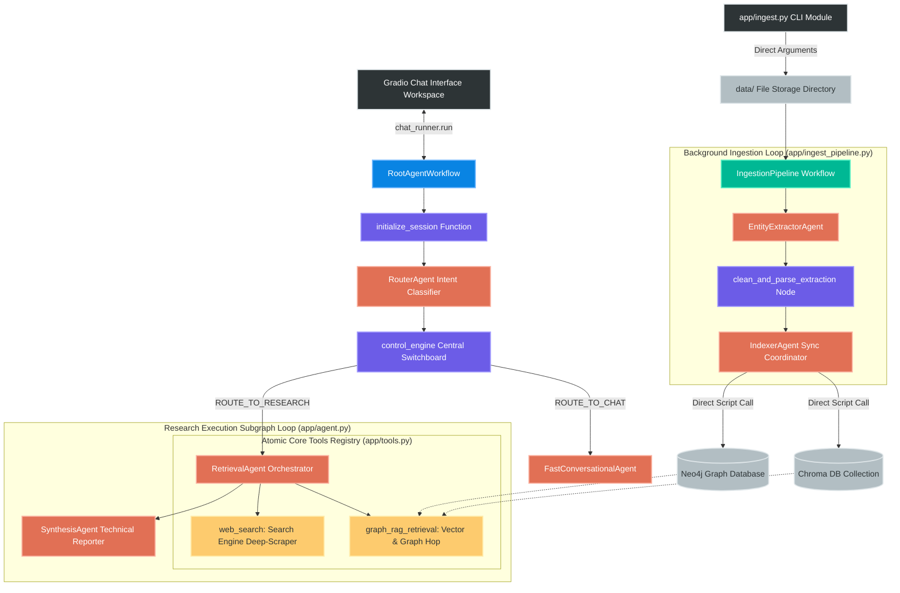

# 🧠 NexusMind Enterprise Architecture — Powered by Nexa

NexusMind is an enterprise-grade GraphRAG (Knowledge Graph + Vector Retrieval-Augmented Generation) platform engineered using the native **Google Agent Development Kit (ADK)** framework. 

The architecture completely decouples background knowledge graph synthesis from real-time user query traversal threads. It introduces a high-performance **Programmatic CPU Parent-Child Chunking Engine** to bypass local model latency barriers, handles large manuals cleanly, and implements a centralized orchestration routing network to handle both low-latency conversational responses and deep-scrape hybrid research loops natively.

---

## 🗺️ 1. Master System Architecture & Pipeline Diagrams

NexusMind replaces monolithic database lookups with a modular ecosystem. The platform separates its operational layers into a high-speed, programmatic **Asynchronous Batch Ingestion Pipeline** and an **Interleaved Multi-Stage Research Loop**.

```text
                                [ PDF Document File Asset ]
                                             │
                                             ▼
                             [ Programmatic CPU Chunk Engine ]
                                (Instant Window Partitioning)
                                             │
                      ┌──────────────────────┴──────────────────────┐
                      ▼                                             ▼
       [ Child Sub-Chunk Arrays ]                      [ Parent Context Chunks ]
        (400 chars / 100 overlap)                          (2000 character blocks)
              │                                             │
              ▼                                             ▼
       ( Chroma Vector DB )                         ( Neo4j Knowledge Graph )
        └─ nomic-embed-text                           ├── Domain Knowledge Layer
                                                      ├── Semantic Claim Layer
                                                      └── Provenance Anchor Layer

```

### 1.1 Live Chat Interaction Turn & Execution Flow

Every frontend conversational request follows a supervisor-routing loop. The diagram below maps how a user query navigates through the gateway, evaluates intent, traverses database maps, and handles live external page scraping deep-dives:



---

## 2. Minimalist Flat Project Layout

The repository utilizes an optimized, flat file topology structure designed to keep folder levels at a minimum for simple execution overhead tracking:

```text
nexusmind-adk/                             # Root workspace repository
├── pyproject.toml                         # Project metadata and toolchain dependencies configurations
├── uv.lock                                # Fast internal locked dependency manifest
├── docker-compose.yaml                    # Local multi-container vector & graph database specs
├── gradio_app.py                          # Streamlined Client Interface Workspace Dashboard
├── architecture.md                        # Design blueprint details
├── PLANNING.md                            # Roadmap items and technical task notes
├── LICENSE                                # Repository permission rights
│
├── config/                                # System Settings Subsystem
│   ├── __init__.py                        # Config initiation block
│   └── settings.py                        # Pydantic Settings environment loader, dotenv bootstrap injector
│
├── data/                                  # Ingestion Landing Strip Directory (Isolated)
│   ├── ML_note.pdf                        # Target raw binary file copies prepared for parser pipelines
│   └── rag_book.pdf                       # Target domain knowledge asset
│
├── storage/                               # Local Mounted Persistent Clusters Volume Mapping
│   ├── chroma_data/                       # Chroma DB vector collection files
│   ├── neo4j_data/                        # Neo4j DBMS authorization and transaction databases
│   ├── pg_data/                           # Relational layer volume cache
│   └── redis_data/                        # Volatile task state cache arrays
│
└── app/                                   # Unified Core Backend Workspace Module
    ├── __init__.py                        # Package init exports
    ├── agent.py                           # Central Graph Topology, Control Switchboard, and Agent definitions
    ├── ingest.py                          # Streamlined manual CLI entry point triggering parsing passes
    ├── ingest_pipeline.py                 # Core background multi-block parsing ingestion pipeline loop
    ├── services.py                        # Programmatic database connectors & CPU-Bound parsing infrastructure
    └── tools.py                           # High-reliability Retrieval & Web Deep-Scraping Toolsets

```

---

## 3. Granular Pipeline Engineering Details

### 3.1 Background Hierarchical Ingestion Pipeline (`app/ingest_pipeline.py`)

To prevent large manuals from breaking local memory limits, text formatting is split away from the models. The orchestrator invokes `pdf_processor.slice_hierarchical_chunks()` to window strings programmatically on the **CPU**. It builds Parent context blocks (~2,000 characters) and Child sub-chunks (~400 characters, 100 overlap) in milliseconds before triggering the active model nodes loop.


#### The Agent Chain:

1. **`EntityExtractorAgent`**: Mines technical domain concepts from each targeted text window, forcing a strict JSON dictionary response structure: `{"entities": [{"name": "X", "type": "Y"}]}`.
2. **`clean_and_parse_extraction` [Transformation Node]**: Intercepts the raw extraction token output, cleanly strips backticks or conversation leakages produced by smaller local models, parses it into an active Python list array, and safeguards the context chain before database synchronization.
3. **`IndexerAgent`**: The database transaction coordinator. It invokes your `save_concept_mention` graph tool to link the newly mined term nodes directly back to the active reference `chunk_id`.

---

### 3.2 Central Routing & Retrieval Funnel Loop (`app/agent.py`)

When an inquiry enters the main app runtime chat interface, it passes through an interleaved multi-database switchboard to solve context drift and eliminate tracking data loss:

#### The Agent Chain:

1. **`initialize_session` [Hook Node]**: Captures the raw user query at the absolute entry point, securely writing it into the active tracking scratchpad memory (`ctx.state["user_query"]`).
2. **`RouterAgent`**: Performs a dynamic textual classification to verify user intent, outputting a single target keyword tag (`CHAT_PATH` or `RESEARCH_PATH`).
3. **`control_engine` [Central Orchestration Switch]**: Evaluates the classification text directly as an input parameter variable, instantly dispatching a framework execution `Event(route="...")` transfer signal.
4. **`FastConversationalAgent`**: Catches simple text inputs (e.g., greetings, short expressions) to generate low-latency friendly responses, bypassing deep infrastructure layers completely.
5. **`RetrievalAgent`**: Triggered exclusively for deep analytical queries. It maps the query parameter and simultaneously executes `graph_rag_retrieval` and `web_search` in parallel to maximize information density.
6. **`SynthesisAgent`**: Gathers raw database logs and internet scrape payloads, fully integrates and deduplicates overlapping data points, strips system technical metadata names from the text stream, and renders a professional Markdown response embedded with explicit inline citations.

---

## 🛠️ 4. Atomic Core Tools Subsystem (`app/tools.py`)

Every tool definition includes explicit `print()` telemetry streaming trackers so you can monitor records hitting your databases in real time from your terminal console.

### 4.1 `graph_rag_retrieval(query)`

* **Vector Step:** Performs a spatial vector proximity sweep using `nomic-embed-text` against ChromaDB to identify the top nearest-neighbor child chunk IDs.
* **Graph Step:** Takes the matching chunk IDs, launches an advanced multi-hop Cypher traversal query in Neo4j, climbs up to the Parent block path, and extracts connected metadata terms instantly.
* **Schema-Defensive Routing:** Employs bi-directional edge fallbacks (`-[:CHILD_OF|PARENT_OF|PART_OF]*..1-`) and Cypher `coalesce()` properties (`p.text`, `p.content`, `p.body`) to prevent DBMS layout mismatch warnings.

### 4.2 `web_search(query)`

* **Engine Step:** Dispatches a structured `POST` form-vector lookup parameter request directly against public directory indexes (`html.duckduckgo.com`).
* **Deep Scrape Step:** Extracts target link paths and drops them right into a synchronous, high-speed `_fetch_url_text_sync` function block.
* **Extraction Stack:** Leverages **`trafilatura.extract()`** first to scrape clean, main-text document blocks while rejecting sidebars, headers, and visual layout noise. Falls back to a custom BeautifulSoup tag-decomposer pipeline (`"script"`, `"style"`, `"noscript"`, `"header"`, `"footer"`, `"svg"`) if necessary.

---

## ⚡ 5. Installation, Production Launch & CLI Ingestion

### 1. Configure the Environment Specs

Ensure a `.env` file exists in your project's root workspace directory containing these configuration settings:

```bash
EXECUTION_MODE="LOCAL"
LOCAL_LLM_URL="http://localhost:11434"

OLLAMA_MODEL="qwen2.5-coder:7b"
EMBEDDING_MODEL="nomic-embed-text"

CHROMA_HOST="localhost"
CHROMA_PORT=8000

NEO4J_URI="bolt://localhost:7687"
NEO4J_USER="neo4j"
NEO4J_PASSWORD="your_secure_neo4j_password"

```

### 2. Install Dependencies

Install the required technical libraries into your virtual environment (enforcing high-speed extraction libraries):

```bash
pip install gradio httpx trafilatura beautifulsoup4 pydantic

```

### 3. Launch Storage Clusters

Launch your vector and graph database container instances via Docker in detached background mode:

```bash
docker compose up -d

```

### 4. Ingest PDF Documents via CLI

Ingestion is executed manually via the terminal, completely decoupling your database writes from your frontend interface. To ingest a local PDF document asset, run:

```bash
python app/ingest.py data/rag_book.pdf

```

### 5. Boot the Interactive Web Interface Dashboard

Launch the clean Gradio interface workspace. It uses native `gr.ChatInterface` properties to run synchronous streaming loops directly to the viewport:

```bash
python gradio_app.py

```

Once running, navigate to **`http://127.0.0.1:7860`** inside your browser window to research your grounded knowledge pools.
