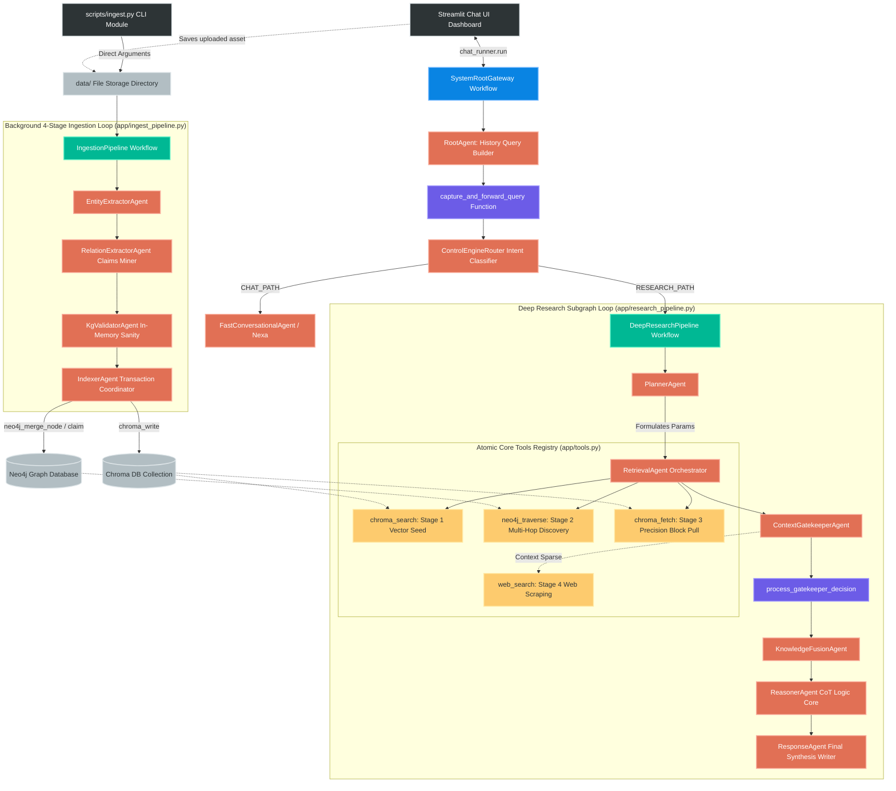
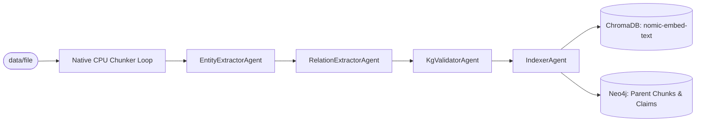

# 🧠 NexusMind Enterprise Architecture — Powered by Nexa

NexusMind is an enterprise-grade GraphRAG (Knowledge Graph + Vector Retrieval-Augmented Generation) platform engineered using the native **Google Agent Development Kit (ADK)** framework. 

The architecture completely decouples background knowledge graph synthesis from real-time user query traversal threads. It introduces a high-performance **Programmatic CPU Parent-Child Chunking Engine** to bypass local model latency barriers and handles large manuals cleanly. It structures a dynamic **Context Gatekeeper Agent** to eliminate data gaps by managing live internet fallback logic natively.

---

## 🗺️ 1. Master System Architecture & Pipeline Diagrams

NexusMind replaces monolithic database lookups with a modular ecosystem. The platform separates its operational layers into a high-speed, programmatic **Asynchronous Batch Ingestion Pipeline** and an **Interleaved Multi-Stage Research Loop**.


```text
                                [ PDF Document File Asset ]
                                             │
                                             ▼
                             [ Programmatic CPU Chunk Engine ]
                                (Instant Window Partitioning)
                                             │
                      ┌──────────────────────┴──────────────────────┐
                      ▼                                             ▼
       [ Child Sub-Chunk Arrays ]                      [ Parent Context Chunks ]
        (400 chars / 100 overlap)                          (2000 character blocks)
              │                                             │
              ▼                                             ▼
       ( Chroma Vector DB )                         ( Neo4j Knowledge Graph )
        └─ nomic-embed-text                           ├── Domain Knowledge Layer
                                                      ├── Semantic Claim Layer
                                                      └── Provenance Anchor Layer

```

### 1.1 Live Chat Interaction Turn & Execution Flow

Every frontend conversational request follows a supervisor-routing loop. The diagram below maps how a user query navigates through the gateway, evaluates intent, traverses database maps, and handles live external fail-safes:



---

## 2. Minimalist Flat Project Layout

The repository utilizes an optimized, flat file topology structure designed to keep folder levels at a minimum for simple execution overhead tracking:

```text
nexusmind-adk/                             # Root workspace repository
├── pyproject.toml                         # Project metadata and toolchain dependencies configurations
├── uv.lock                                # Fast internal locked dependency manifest
├── docker-compose.yaml                    # Local multi-container vector & graph database specs
├── main.py                                # Pre-flight hardware connectivity verification & diagnostics
├── run.sh                                 # Global environment check & runtime service execution gateway
├── streamlit_app.py                       # Client interface dashboard (Direct runner connection, no engine middleman)
├── PLANNING.md                            # Blueprint, task items, and technical notes
├── LICENSE                                # Repository permission rights
├── nexusmind_runtime.log                  # Rolling backend operational tracking output trace
│
├── config/                                # System Settings Subsystem
│   ├── __init__.py                        # Config initiation block
│   └── settings.py                        # Pydantic Settings environment loader, dotenv bootstrap injector
│
├── data/                                  # Ingestion Landing Strip Directory (Isolated)
│   └── rag_details.pdf                    # Target raw binary file copies prepared for parser pipelines
│
├── scripts/                               # Production Operational Shell Wrappers
│   ├── __init__.py                        # Script pack exports
│   └── ingest.py                          # Streamlined CLI module triggering file-driven ingest workers
│
└── app/                                   # Unified Core Backend Workspace Module
    ├── __init__.py                        # Package init exports
    ├── agent.py                           # Framework bridge file re-exporting root_agent for adk web UI
    ├── root_gateway.py                    # Gateway orchestrator (Supervisor Agent, Router Graph, and Paths)
    ├── research_pipeline.py               # 5-stage deep analytical reasoning workflow layout
    ├── ingest_pipeline.py                 # Optimized multi-block processing pipeline loop
    ├── infrastructure.py                  # PyPDF extracts, CPU Chunkers, Chroma clients, and Neo4j connection poolers
    ├── tools.py                           # Functional read/write database tool sets with real-time log prints
    └── states.py                          # Unified prompt instruction vault and structured Pydantic schemas

```

---

## 3. Granular Pipeline Engineering Details

### 3.1 Background Hierarchical Ingestion Pipeline (`app/ingest_pipeline.py`)

To prevent large manuals from breaking local memory limits, text formatting is split away from the models. The orchestrator invokes `pdf_extractor.slice_hierarchical_chunks()` to window strings programmatically on the **CPU**. It builds Parent context blocks (~2,000 characters) and Child sub-chunks (~400 characters, 100 overlap) in milliseconds before triggering the active model nodes loop.



#### The Agent Chain:

1. **`EntityExtractorAgent`**: Mines technical domain nodes (`Component`, `Architecture`, `Constraint`, `Metric`) from each targeted parent string, formatting a clean JSON dictionary payload including failure mode definitions.
2. **`RelationExtractorAgent`**: Identifies operational system interactions (`DEPENDS_ON`, `FEEDS_DATA_TO`, `HAS_CONSTRAINT`, `MITIGATES`) and isolates them into structured intermediate **Interaction Claim** JSON schemas.
3. **`KgValidatorAgent`**: Operates entirely within runtime memory cache to check schema referential integrity, matching edge nodes to existing entities and removing orphaned metrics.
4. **`IndexerAgent`**: The database transaction coordinator. It invokes tools to index child text components to **Chroma**, commits Parent nodes to **Neo4j**, and links them structural-wise via explicit tracking paths (`[:MENTIONED_IN] -> (:Entity {label: 'ChildChunk'})`).

---

### 3.2 Dynamic Multi-Stage Research Loop (`app/research_pipeline.py`)

When an inquiry enters the research workflow, the agents do not perform isolated vector queries. Instead, they execute an interleaved retrieval funnel to explore multi-hop factual paths.

#### The Agent Chain:

1. **`PlannerAgent`**: Deconstructs the inquiry, outputting a precise JSON parameter map containing optimized search keys.
2. **`RetrievalAgent`**: The pipeline gatherer. It executes an interleaved multi-database lookup loop via customized tools:
* **Stage 1 (`chroma_search`):** Scans the vector store via `nomic-embed-text` to retrieve the top nearest-neighbor child chunk IDs.
* **Stage 2 (`neo4j_traverse`):** Reads the retrieved chunk IDs, enters Neo4j, climbs up to the Parent block path, and traverses 1–2 hops out to discover connected concepts and hidden structural **Claims**.
* **Stage 3 (`chroma_fetch`):** Precision-extracts missing neighboring text segments using the target neighbor chunk IDs discovered on the graph trail.


3. **`ContextGatekeeperAgent`**: **The system evaluator core.** It evaluates data completeness against the user prompt:
* *Verdict -> SUFFICIENT:* Forwards context strings directly down to the fusion engine block.
* *Verdict -> INSUFFICIENT:* Automatically executes **Stage 4 (`web_search`)** to scrape missing real-time context, merges it with the database records, and forwards the package.


4. **`KnowledgeFusionAgent`**: Formats combined streams, deduplicating records and grouping overlapping semantic fields.
5. **`ReasonerAgent`**: Runs a multi-turn Chain-of-Thought (CoT) deduction process, tracing how the graph layout matches the vector facts.
6. **`ResponseAgent`**: Compiles the final answer in structured markdown with strict, inline bracketed source citations pointing directly back to document chunks.

---

### 3.3 System Root Supervisor Gateway (`app/root_gateway.py`)

This pipeline serves as the primary system entry point, managing conversational turns, keeping state parameters persistent, and shielding local LLMs from context drift.

1. **`RootAgent`**: Autonomous context rewriter. It parses conversation histories to distill multi-turn context into a singular standalone inquiry.
2. **`capture_and_forward_query`**: A Python interceptor function that saves the rewritten standalone question inside the workflow context state instance (`resolved_query`) before routing.
3. **`ControlEngineRouter`**: An intent classifier agent that reads the clean string and outputs a single uppercase token (`RESEARCH` or `CASUAL_CHAT`).
4. **`determine_workflow_path`**: Evaluates the keyword token. If `RESEARCH` is matched, it fetches the pristine `resolved_query` back out from memory context state and forwards it down into the `deep_research_subgraph`. If `CASUAL_CHAT` is matched, it routes to `FastConversationalAgent`.

---

## 🛠️ 4. Atomic Core Tools Subsystem (`app/tools.py`)

Every tool definition includes explicit `print()` telemetry streaming trackers so you can monitor records hitting your databases in real time from your terminal console.

### Ingestion Tool Registry

* **`chroma_write`**: Vectorizes and indexes a single child text chunk into Chroma, returning the unique identity string token format `{document_name}_chunk_{index}`.
* **`neo4j_merge_node`**: Creates or updates a domain concept node, applying properties and anchoring its pointer reference to the vector chunk token (`:MENTIONED_IN`).
* **`neo4j_merge_claim`**: Implements relationship reification. It creates an independent `(:Interaction)` node, binds it between subject/object entities, and hooks its provenance path directly to the child chunk ID.

### Retrieval Tool Registry

* **`chroma_search`**: Runs an active vector similarity scan against Chroma to grab top child sub-chunks matching the query string.
* **`neo4j_traverse`**: Runs an advanced Cypher lookup extending outward from a chunk token to return multi-hop element graphs and structural interaction rules.
* **`chroma_fetch`**: Fetches the raw text content of any target chunk ID found via the graph.
* **`web_search`**: Scrapes external duckduckgo network channels as an emergency fallback if the local knowledge pool is sparse.

---

## ⚡ 5. Installation, Production Launch & CLI Ingestion

### 1. Configure the Environment Specs

Ensure a `.env` file exists in your project's root workspace directory containing these configuration settings:

```bash
# Options: LOCAL (Ollama Local Topology) or CLOUD (Gemini Cloud)
EXECUTION_MODE="LOCAL"

GEMINI_API_KEY="your_google_ai_studio_api_key"
LOCAL_LLM_URL="http://localhost:11434"

OLLAMA_MODEL="qwen2.5-coder:7b"
GEMINI_MODEL="gemini-2.5-flash"
EMBEDDING_MODEL="nomic-embed-text"

CHROMA_HOST="localhost"
CHROMA_PORT=8000

NEO4J_URI="bolt://localhost:7687"
NEO4J_USER="neo4j"
NEO4J_PASSWORD="your_neo4j_password"

```

### 2. Launch Storage Clusters

Launch your vector and graph database container instances in detached background mode:

```bash
docker compose up -d

```

### 3. Clear Cache Repositories (Dimension Alignment Pre-flight)

Because `nomic-embed-text` enforces a strict 768-dimension coordinate system, old database runs must be reset to avoid matrix conflicts:

```
http://localhost:7474
```

```cypher
// Clear Neo4j from your Neo4j Browser window:
MATCH (n) DETACH DELETE n;

```

### 4. Ingest PDF Documents via CLI

To ingest your documents directly via your terminal workspace, run the standalone ingestion module with the source file location path:

```bash
python -m scripts.ingest data/rag_details.pdf

```

*(Your terminal will stream custom live console tracing logs as the programmatic chunker handles windows, followed by your sequential model extraction passes!)*

### 5. Boot the Interactive Web Interface Dashboard

Launch the unified client dashboard UI to chat with **Nexa** and monitor cognitive retrieval paths:

```bash
streamlit run streamlit_app.py

```
