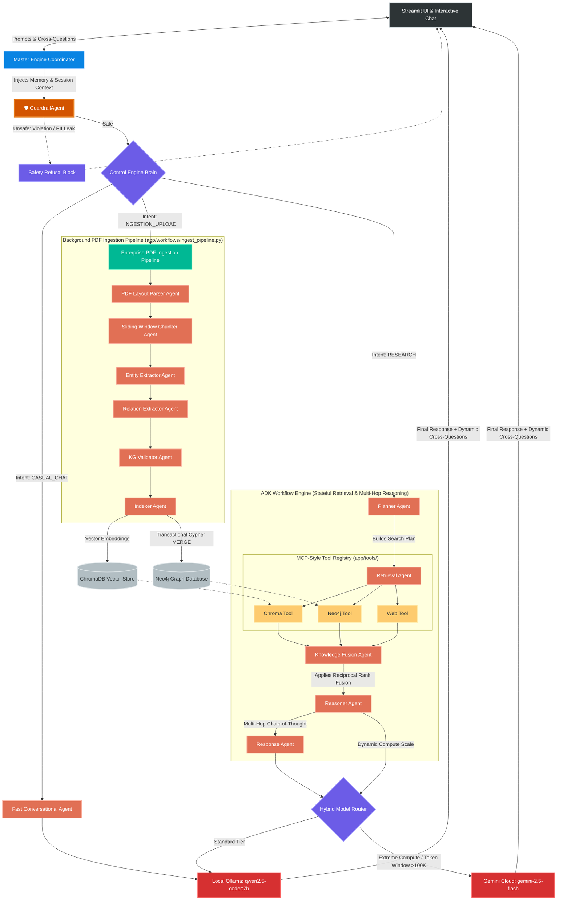
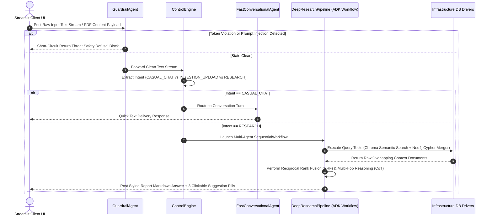

# 🧠 NexusMind Enterprise Architecture — Powered by Nexa

NexusMind is an enterprise-grade GraphRAG (Knowledge Graph + Vector Retrieval-Augmented Generation) platform engineered using the native **Google Agent Development Kit (ADK 2.0)** framework. The architecture completely decouples background knowledge graph synthesis from real-time user query traversal threads.

By unifying local inference engines (**Ollama: `qwen2.5-coder:7b**` for privacy and edge-speed calculations) with high-context cloud endpoints (**Gemini Cloud: `gemini-2.5-flash**` for deep analytical synthesis), NexusMind provides a stateful, interactive experience. The system's conversational bot, **Nexa**, supports user interruptions, multi-hop reasoning, and click-to-ask follow-up cross-questions.

---

## 1. System Topology & Architectural Flows

### 1.1 Macro-System Communication Subsystems

The diagram below details the end-to-end transaction paths for raw document ingestion streams and runtime multi-agent retrieval loops.



### 1.2 System Runtime Interaction Loop

The sequence diagram below displays the step-by-step transaction lifecycle of an execution turn through the system layers:



---

## 2. Standardized Project Layout

This tree shows the directory mapping for the workspace, aligning with the structural definitions required by modern `uv` development patterns:

```text
nexusmind-adk/                             # Root workspace repository
├── .env                                   # Target credentials, model parameters, and driver ports
├── docker-compose.yaml                    # Local multi-container database service specs
├── pyproject.toml                         # Modern hatchling project dependency manifest
├── uv.lock                                # Fast internal locked dependency manifest
├── main.py                                # Pre-flight hardware connectivity diagnostic testing script
├── streamlit_app.py                       # Client interface and binary stream uploader layer
│
├── config/                                # Configuration Verification Layer
│   └── settings.py                        # Pydantic Settings env loader and validator
│
├── app/                                   # Core Application Engine Workspace
│   ├── __init__.py                        # Core application initialization mapping
│   │
│   ├── core/                              # Orchestration Management Hub
│   │   ├── control_engine.py              # Rule-based intent classifier and query analyzer
│   │   └── llm_router.py                  # Dynamic context monitoring compute allocator
│   │
│   ├── models/                            # Pydantic Structured State Contracts
│   │   ├── chat_state.py                  # Telemetry contracts for chat and retrieval nodes
│   │   └── ingest_state.py                # Graph structural schemas for PDF parsing
│   │
│   ├── infrastructure/                    # Low-Level Concrete Database Drivers
│   │   ├── chroma_service.py              # ChromaDB client wrapper & Ollama embedding generation
│   │   └── neo4j_service.py               # Thread-safe connection pool manager for Bolt instances
│   │
│   ├── tools/                             # Functional MCP System Plugin Registries
│   │   ├── indexer_tools.py               # Low-level write and data-mutation operations
│   │   └── mcp_registry.py                # Low-level read and context-gathering tools
│   │
│   ├── prompts/                           # Instruction Template Vault
│   │   └── system_prompts.py              # System prompt definitions
│   │
│   ├── workflows/                         # Declarative Graph Workflow Pipeline Controllers
│   │   ├── ingest_pipeline.py             # 6-stage background document indexing manager
│   │   └── master_pipeline.py             # Global brain controller & dynamic routing manager
│   │
│   └── agents/                            # Primitives for Isolated Framework Agents
│       ├── fast_agent.py                  # Lightweight conversational turn engine
│       ├── guardrail_agent.py             # Safety security barrier proxy
│       ├── ingest_nodes.py                # Document ingestion indexing agents
│       ├── research_nodes.py              # Research multi-hop retrieval agents
│       └── router_agent.py                # Semantic intent analysis agent
│
└── tests/                                 # Automated Validation Layer
    └── integration/                       # End-to-End Test Modules
        └── test_pipeline.py               # Async multi-agent transaction test suite

```

---

## 3. Granular Agent & Pipeline Engineering Details

### 3.1 Asynchronous Background Ingestion Pipeline

Processes binary data buffers into clean text records across both storage systems through 6 specialized steps:

1. **`PDFLayoutParserAgent`**: Unpacks byte streams, cleans running footnotes, and extracts clear raw text.
2. **`SlidingWindowChunkerAgent`**: Splits long text segments into consistent sliding text windows (500 chars, 100 overlap) to keep semantic chunks unbroken.
3. **`EntityExtractorAgent`**: Extracts isolated domain nodes, matching categories like `SYSTEM`, `TECHNOLOGY`, or `PERSON`.
4. **`RelationExtractorAgent`**: Connects matching entity structures together using clear predicates formatted in `SCREAMING_SNAKE_CASE`.
5. **`KgValidatorAgent`**: Verifies graph consistency, drops orphaned references, and ensures perfect structural schema compliance.
6. **`IndexerAgent`**: Communicates with the low-level service drivers to add text blocks into Chroma DB and run `MERGE` updates in Neo4j.

### 3.2 Dynamic Retrieval & Multi-Hop Reasoning Pipeline

Processes exploratory queries by scoring context windows and applying advanced retrieval filtering:

* **`PlannerAgent`**: Breaks compound user text queries into targeted lookups for both vector and graph databases.
* **`RetrievalAgent`**: Calls active data tools (`chroma_tool`, `neo4j_tool`, `web_tool`) concurrently.
* **`KnowledgeFusionAgent`**: Merges multi-source contexts mathematically via Reciprocal Rank Fusion (RRF) to eliminate structural data block overlaps:

$$RRF\_Score(d \in D) = \sum_{m \in M} \frac{1}{60 + r_m(d)}$$


* **`ReasonerAgent`**: Performs multi-hop Chain-of-Thought (CoT) tracking over the ranked context block to identify distant entity linkages.
* **`ResponseAgent`**: Compiles final reports with clean markdown, source citations, and automatically generates exactly 3 clickable follow-up question pills.

---

## 4. Installation & Production Launch Commands

### 1. Initialize Virtual Environment and Workspace Dependencies

Ensure you have `uv` installed on your machine. Run these commands from your root terminal:

```bash
# Create local virtual python environment sandbox
uv venv

# Activate local environment
source .venv/bin/activate  # Windows command: .venv\Scripts\activate

# Install dependencies and map the local project workspace
uv sync

```

### 2. Configure Environment Secrets

Ensure a `.env` file exists in your project's root directory containing these exact key configurations:

```bash
# Model Infrastructure Configurations
GEMINI_API_KEY="your_actual_gemini_api_key_string"
LOCAL_LLM_URL="http://localhost:11434"

# Model Specific Target Assignments
OLLAMA_MODEL="qwen2.5-coder:7b"
GEMINI_MODEL="gemini-2.5-flash"

# Database Connection Infrastructure
CHROMA_HOST="localhost"
CHROMA_PORT=8000

NEO4J_URI="bolt://localhost:7687"
NEO4J_USER="neo4j"
NEO4J_PASSWORD="rana1234"

```

### 3. Spin Up Storage Containers

Launch the core multi-container environment in background detached mode:

```bash
docker compose up -d

```

### 4. Run Pre-Flight Diagnostics

Verify local endpoint statuses and cluster accessibility configurations before starting the UI layer:

```bash
uv run python main.py

```

### 5. Launch the Client Interface

```bash
uv run streamlit run streamlit_app.py

```
